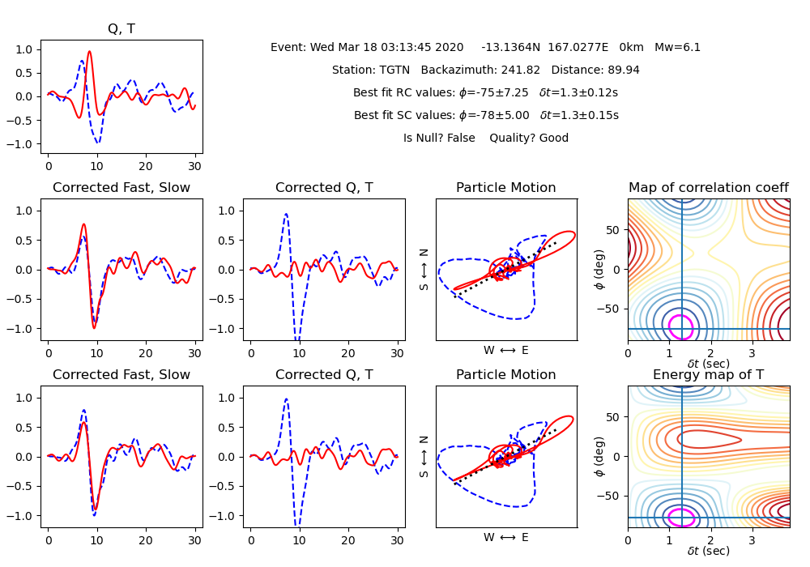
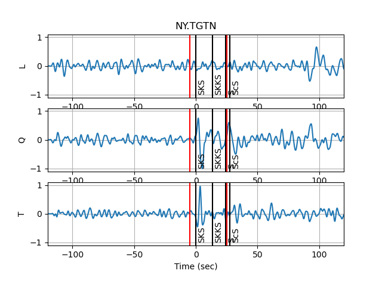

# SplitPy: Software for teleseismic shear-wave splitting analysis


SplitPy is a teleseismic shear-wave (SKS) Splitting Toolbox based on the 
Matlab Tool [`SplitLab`](http://splitting.gm.univ-montp2.fr), 
but with modifications from [Wustefeld et al (2008)](#references). 
Additional error surface implementation has been added, however these error 
surfaces have not been fully tested. The code produces output identical to
those in [Audet et al. (2016)](#references)

## Installation

### Dependencies

The current version was developed using **Python3.7** \
Also, the following packages are required:

- [`obspy`](https://github.com/obspy/obspy/wiki)
- [`stdb`](https://github.com/paudetseis/StDb)
- [`dill`](https://pypi.org/project/dill/)
- [`PyQt5`](https://pypi.org/project/PyQt5/)

#### Conda environment

We recommend creating a custom 
[conda environment](https://conda.io/docs/user-guide/tasks/manage-environments.html)
where `SplitPy` can be installed along with its dependencies.

```bash
   conda create -n split python=3.7 obspy dill -c conda-forge
```

Activate the newly created environment:

```bash
   conda activate split
```

Install remaining dependencies using `pip` inside the `split` environment. 
Note that you need to install `StDb` from source at this time:

```bash
   git clone https://github.com/paudetseis/StDb.git
   cd StDb
   pip install .
   pip install PyQt5
```

### Installing from source

Download or clone the repository:
```bash
git clone https://github.com/paudetseis/SplitPy.git
cd SplitPy
```

Next we recommend following the steps for creating a `conda` environment 
(see [above](#conda-environment)). Then install using `pip`:

```bash
pip install .
``` 

<!-- .. note::

   Please note, if you are actively working on the code, or making frequent edits, it is advisable
   to perform the pip installation with the ``-e`` flag. This enables an editable installation, where
   symbolic links are used rather than straight copies. This means that any changes made in the
   local folders will be reflected in the packages available on the system.
 -->

## Usage 

### Documentation

The documentation for all classes and functions in `splitpy` can be accessed 
from https://paudetseis.github.io/SplitPy/.

### Package Contents

`splitpy`: Python Module

* data download and reading tools
* splitting calculation tools

`Scripts`: Python scripts designed to be run on the command line
* `sks_split.py`: all in one sks splitting calculations based on stations 
contained within a station database file
* `sks_plot_results.py`: plot the resulting split files for a given station
* `sks_prep.py`: download and prepare the data for computing splitting. Saves 
seismograms for computing splitting at a later time. Used in conjunction with 
`sks_OL_proc.py`.
* `sks_OL_proc.py`: compute the splitting for an archive of data that has been 
downloaded and prepared by `sks_prep.py`. This script can be run offline without 
an internet connection, but data must be in a specific format.


### Examples

Perform SKS splitting measurements on station EPYK in a database.

```bash
$ query_fdsn_stdb.py -N TA -C BH? -S EPYK new_list.pkl

$ sks_split.py --keys=TA.EPYK --local-data=/mnt/datadisk/DaySac/ new_list.pkl
```

This uses all default settings for window lengths, magnitude criteria, etc. 
In this example, data will be used from both IRIS as well as any local data 
on disk (defined with the `--local-data` flag). If no data exists on disk, then 
the program will search on the specific data sever (through 
[`obspy`](https://github.com/obspy/obspy/wiki) clients).

Based on the criteria specified (see `sks_split.py -h`), events will be processed. 
The analysis will proceed for an event where the minimum SNR threshold is exceeded. 
Two Figure windows will pop up. `Figure 1` is the three components for the waveforms, 
LQT, along with lines representing the SKS, SKKS, S and ScS arrivals. Red vertical 
lines denote the window. This figure is interactive and the picksin red can be refined.



`Figure 2` summarizes the results of the splitting calculation. The top left "Q,T" 
frame shows the un-corrected radial (Q) and tangential (T) components within 
the time window. The second 
row of panels correspond to the 'Rotation-Correlation' results, and the third row of 
panels is for the 'Silver-Chan' results. In each case, the first column shows 
the corrected Q and T fast and slow components, the second column the corrected 
Q and T components, the third column the *before* and *after* particle motion, and 
the fourth column the map of the error surfaces. A text box prints out the summary
of the results, including whether or not the estimate is a *Null*, and the quality
of the estimate ('good', 'fair', 'poor').



A message box will pop up asking whether to Re-pick the window. This can be done 
to refine the signal window in which the measurements are made in order to
improve the measurements.

The terminal will show a summary of the processing, including an examination for the 
Null/Non-Null classification as well as the quality of the estimate.

Once `No` is selected for the picking/re-picking of the window, a second box will 
pop up asking whether to keep the estimates. Click `Yes` to save the results, 
or `No` to discard the measurement.

The results of processing are saved into a *./RESULTS* folder in the current working 
directory, in a subfolder named after the station key. In this example, *./RESULTS/TA.EPYK*.

Each measurement is stored in a separate `pickle` (.pkl) file named 
`Split.STN.YYYY.JJJ.HHMMSS.pkl`.

Plotting and subsequent processing of splitting results is carried out using 
`sks_plot_results.py`, where options are present to control selection of nulls 
and quality settings, as well as which methods are used. The path to a station 
*./RESULT* folder is provided and all `Split.*.pkl` files are loaded. The final 
average splits are then saved in a text file for future use.

## References

- Audet, P., Sole, C., and Schaeffer, A.J. (2016). Control of lithospheric
  inheritance on neotectonic activity in northwestern Canada? Geology,
  44, 807-810, https://doi.org/10.1130/G38118.1

- Wustefeld, A., and Bokelmann, G. (2007). Null detection in shear-wave splitting 
  measurements. Bulletin of the Seismological Society of America, 97, 1204-1211,
  https://doi.org/10.1785/0120060190

- Wustefeld, A., Bokelmann, G., Zeroli, C., and Barruol, G. (2008). SplitLab: 
  A shear-wave splitting environment in Matlab. Computers & Geoscience, 34, 
  515-528, https://doi.org/10.1016/j.cageo.2007.08.002
